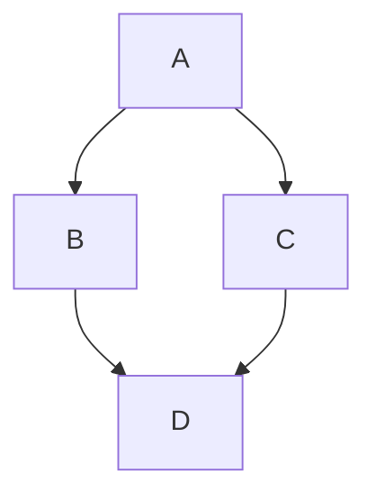

# GitHub Markdown feature fixture

Every feature documented under "Writing on GitHub" on docs.github.com that applies to a
Markdown file in a repository. The browser check script asserts on the rendered DOM of this file.

## Headings

### A third-level heading

#### A fourth-level heading

##### A fifth-level heading

###### A sixth-level heading

## Styling text

**This is bold text** and __this is bold too__.

_This text is italicized_ and *so is this*.

~~This was mistaken text~~ and ~this uses a single tilde~.

**This text is _extremely_ important**

***All this text is important***

This is a <sub>subscript</sub> text, a <sup>superscript</sup> text and an <ins>underlined</ins> text.

Press <kbd>Command</kbd>+<kbd>B</kbd> to bold.

## Quoting text

Text that is not a quote

> Text that is a quote

## Quoting code

Use `git status` to list all new or modified files that haven't yet been committed.

Some basic Git commands are:

```
git status
git add
git commit
```

````
```
Look! You can see my backticks.
```
````

## Syntax highlighting

```ruby
require 'redcarpet'
markdown = Redcarpet.new("Hello World!")
puts markdown.to_html
```

```js
function test() {
  console.log("notice the blank line before this function?");
}
```

```lua
local M = {}
function M.setup(opts) return vim.tbl_extend("force", {}, opts or {}) end
```

## Supported color models

The background color is `#ffffff` for light mode and `#000000` for dark mode.

`#0969DA` `rgb(9, 105, 218)` `hsl(212, 92%, 45%)`

## Links

This site was built using [GitHub Pages](https://pages.github.com/).

Visit https://github.com and www.github.com, but example.com stays plain text.

## Section links

Link to the sample section: [Link Text](#sample-section).

## Sample Section

## This'll be a _Helpful_ Section About the Greek Letter Θ!

A heading containing characters not allowed in fragments, UTF-8 characters and formatting.

## This heading is not unique in the file

TEXT 1

## This heading is not unique in the file

TEXT 2

Link to the helpful section: [Link Text](#thisll-be-a-helpful-section-about-the-greek-letter-θ).

Link to the second non-unique section: [Link Text](#this-heading-is-not-unique-in-the-file-1).

## Relative links

[Another Markdown file](other.md) and [the same file](./github-features.md#links).

[A file that is not Markdown](images/swatch-light.png) and [outside the root](../../../../outside.md).

[A source file](example.lua) and [the notes](notes.txt) are neither Markdown nor media, and [a missing Markdown file](missing.md) does not exist.

## Custom anchors

<a name="my-custom-anchor-point"></a>
Some text I want to provide a direct link to, but which doesn't have its own heading.

[A link to that custom anchor](#my-custom-anchor-point)

## Line breaks

This example  
Will span two lines

This example\
Will span two lines

This example<br/>
Will span two lines

This example

Will have a blank line separating both lines

## Images


### The Picture element

<picture>
  <source media="(prefers-color-scheme: dark)" srcset="images/swatch-dark.png">
  <source media="(prefers-color-scheme: light)" srcset="images/swatch-light.png">
  
</picture>

## Videos

A link to a video file becomes a player: [clip](images/clip.mp4)

## Lists

- George Washington
* John Adams
+ Thomas Jefferson

To order your list, precede each line with a number.

1. James Madison
2. James Monroe
3. John Quincy Adams

A nested list:

1. First list item
   - First nested list item
     - Second nested list item

A list that starts at 100:

100. First list item
     - First nested list item
       - Second nested list item

## Task lists

- [x] #739
- [ ] https://github.com/octo-org/octo-repo/issues/740
- [ ] Add delight to the experience when all tasks are complete :tada:
- [ ] \(Optional) Open a followup issue

## Mentioning people and teams

@github/support What do you think about these updates?

## Using emojis

@octocat :+1: This PR looks great - it's ready to merge! :shipit:

Text emoticons stay text :) :-( ;)

## Footnotes

Here is a simple footnote[^1].

A footnote can also have multiple lines[^2].

[^1]: My reference.
[^2]: To add line breaks within a footnote, add 2 spaces to the end of a line.  
This is a second line.

## Alerts

> [!NOTE]
> Useful information that users should know, even when skimming content.

> [!TIP]
> Helpful advice for doing things better or more easily.

> [!IMPORTANT]
> Key information users need to know to achieve their goal.

> [!WARNING]
> Urgent info that needs immediate user attention to avoid problems.

> [!CAUTION]
> Advises about risks or negative outcomes of certain actions.

## Hiding content with comments

<!-- This content will not appear in the rendered Markdown -->

## Ignoring Markdown formatting

Let's rename \*our-new-project\* to \*our-old-project\*.

## Tables

| First Header  | Second Header |
| ------------- | ------------- |
| Content Cell  | Content Cell  |
| Content Cell  | Content Cell  |

| Command | Description |
| --- | --- |
| `git status` | List all *new or modified* files |
| `git diff` | Show file differences that **haven't been** staged |

| Left-aligned | Center-aligned | Right-aligned |
| :---         |     :---:      |          ---: |
| git status   | git status     | git status    |
| git diff     | git diff       | git diff      |

| Name     | Character |
| ---      | ---       |
| Backtick | `         |
| Pipe     | \|        |

## Collapsed sections

<details>

<summary>Tips for collapsed sections</summary>

### You can add a header

You can add text within a collapsed section.

```ruby
   puts "Hello World"
```

</details>

<details open>
<summary>Open by default</summary>

Visible content.

</details>

## Diagrams

Here is a simple flow chart:



```geojson
{"type": "Point", "coordinates": [-90, 35]}
```

## Mathematical expressions

This sentence uses `$` delimiters to show math inline: $\sqrt{3x-1}+(1+x)^2$

This sentence uses dollar-backtick delimiters to show math inline: $`\sqrt{3x-1}+(1+x)^2`$

Emphasis characters stay inside math: $a_1 * b_2$ and $x_i * y_j$.

**The Cauchy-Schwarz Inequality**\
$$\left( \sum_{k=1}^n a_k b_k \right)^2 \leq \left( \sum_{k=1}^n a_k^2 \right) \left( \sum_{k=1}^n b_k^2 \right)$$

$$
\int_0^\infty e^{-x^2} \, dx = \frac{\sqrt{\pi}}{2}
$$

```math
\left( \sum_{k=1}^n a_k b_k \right)^2 \leq \left( \sum_{k=1}^n a_k^2 \right) \left( \sum_{k=1}^n b_k^2 \right)
```

This expression uses `\$` to display a dollar sign: $`\sqrt{\$4}`$

To split <span>$</span>100 in half, we calculate $100/2$

## Sanitizer probes

<script>window.__mpInjected = 'script';</script>


<p style="color: red" id="styled-paragraph">This paragraph had a style attribute.</p>

<iframe src="https://example.com"></iframe>

<form action="https://example.com"><input type="text" name="q"><button>Send</button></form>

<svg onload="window.__mpInjected = 'svg'"><circle r="4"></circle></svg>

[A javascript: link](javascript:window.__mpInjected='link')

<p data-line-start="2000000000" data-line-end="2000000001" id="forged-lines">Forged line attributes.</p>

<a href="https://github.com/x" data-mp-open="other.md" id="forged-open">Forged open link</a>

<a href="https://example.com/page" data-mp-video="https://example.com/x.mp4" id="forged-video">Forged video link</a>

<div class="highlight" data-mp-kind="code" data-mp-lang="js"><pre>forged highlight</pre></div>

<div class="mp-status" id="fake-status">Fake status banner</div>

<div class="mp-errors" id="fake-errors">Fake error box</div>

Math commands that reach outside the formula: $\href{https://example.com}{x}$ and $\style{position:fixed;top:0}{y}$ and $\cssId{mp-status}{z}$ and $\class{mp-status}{w}$

A scaled formula: $\style{transform:scale(300);transform-origin:center;fill:red;}{\rule{1em}{1em}}$

## Stamp absorption probes

> <div id="absorb1" data-mp-kind="mermaid"
>
> graph TD; A-->B

- <div id="absorb2" data-mp-kind="math" data-mp-lang="js" data-mp-media="(prefers-color-scheme: dark)" data-mp-unavailable

  x_1 * y_2

> <div id="leak1" title='
>
> swallowed paragraph, it's here

<details id="absorb4">
<summary>Merged details</summary>

<div id="absorb4b" data-mp-kind="math"

x_1 * y_2

</details>

Math data attributes: $\data{mp-kind=mermaid,line-start=0}{x}$

## Encoded path probes

[Encoded escape](a%2F..%2F..%2F..%2F..%2F..%2Fx.md) and <a href="..\..\..\..\x.md" id="bs-escape">backslash escape</a>


